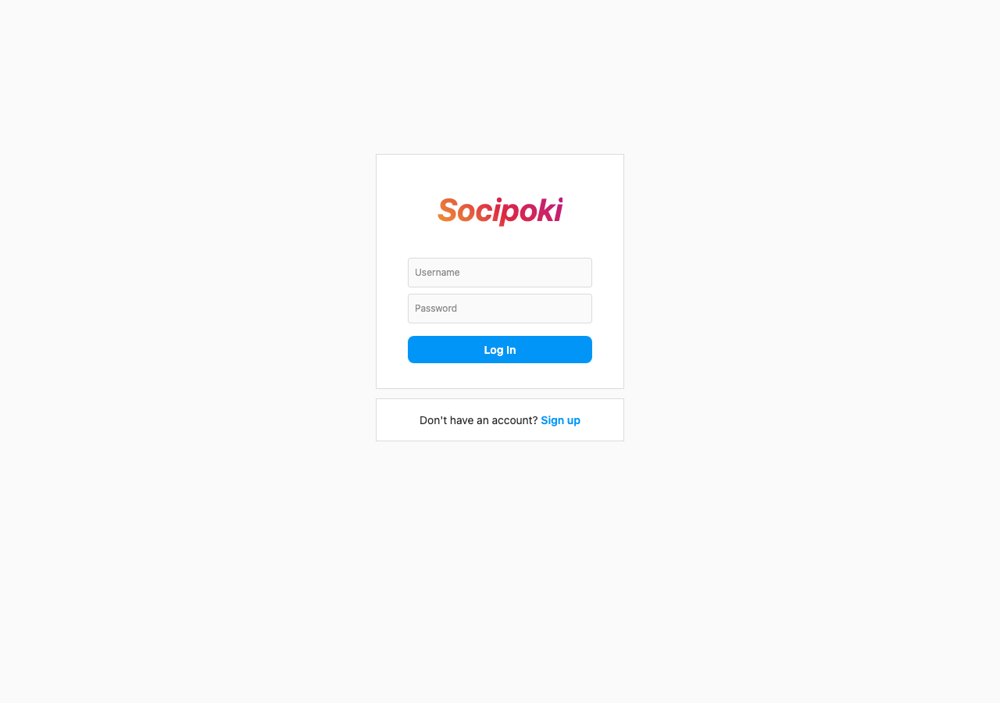
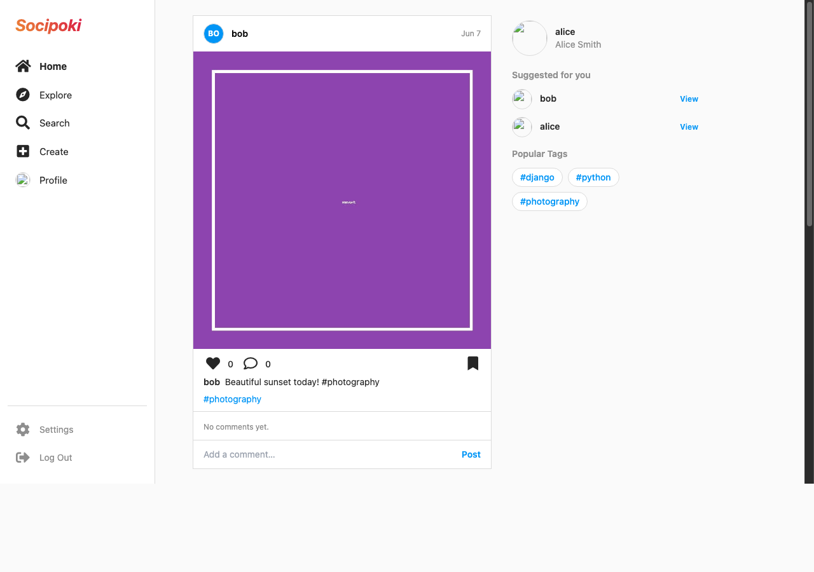
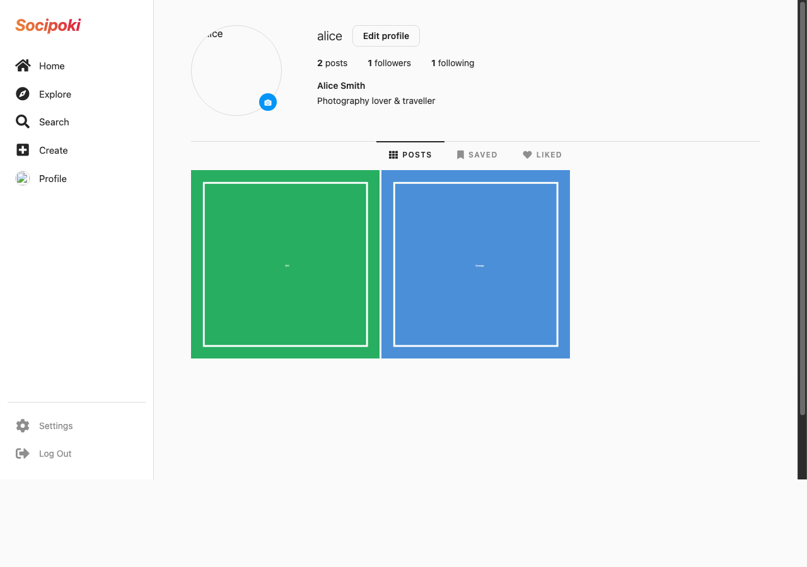
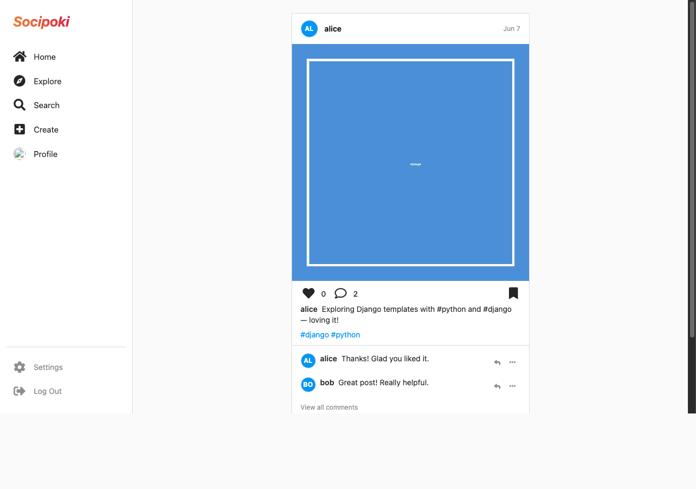
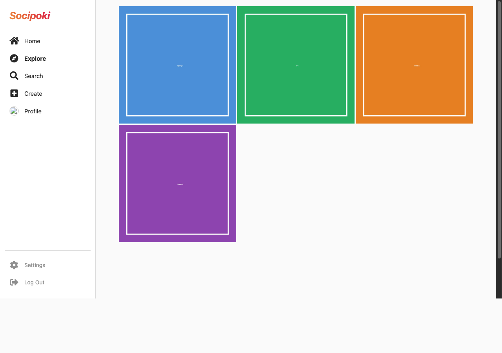

# Socipoki — Open-Source Social Media Platform

> An Instagram-inspired social media web application built with Django. Share photos, follow people, discover content through hashtags, and engage with a community.

[](https://python.org)
[](https://djangoproject.com)
[](LICENSE)
[](CONTRIBUTING.md)

---

## Table of Contents

- [About](#about)
- [Features](#features)
- [Tech Stack](#tech-stack)
- [Screenshots](#screenshots)
- [Getting Started](#getting-started)
  - [Prerequisites](#prerequisites)
  - [Installation](#installation)
  - [Environment Variables](#environment-variables)
  - [Running the App](#running-the-app)
- [Project Structure](#project-structure)
- [Roadmap](#roadmap)
- [Contributing](#contributing)
- [License](#license)
- [Author](#author)

---

## About

**Socipoki** is a full-stack social media web application that replicates the core experience of photo-sharing platforms. Users can create accounts, upload posts with images, follow each other, interact through likes/saves/comments, and discover new content through hashtags and an algorithm-ranked explore page.

This project is built with Django and is intended as both a functional MVP and a learning resource for developers interested in social media application architecture.

> **Note:** This repository is being prepared for public release. Some sections — such as screenshots, deployment guides, and final environment variable documentation — may need project-specific updates before your first public launch.

---

## Features

### User Accounts
- Register, log in, and log out
- Edit profile (name, username, email, bio, website URL)
- Upload and auto-resize profile avatar (200×200 px)
- Change password securely

### Social Graph
- Follow / unfollow other users
- Follow request system with accept/decline flow
- View followers and following lists per profile

### Posts
- Create posts with image uploads
- Automatic multi-resolution image generation (1500×, 500×, 250×, original)
- Unique permalink per post via hashed ID
- Like and save posts
- View liked and saved posts per profile

### Comments
- Comment on posts
- Nested replies (sub-comments)
- Delete your own comments

### Discovery
- Home feed of posts from followed users
- Explore page with weighted ranking (likes × 0.5 + saves × 0.8 + tag count × 0.2)
- Hashtag extraction from post descriptions
- Tag detail pages listing all tagged posts
- Search across users, posts, and tags

---

## Tech Stack

| Layer | Technology |
|---|---|
| Language | Python 3.12 |
| Framework | Django 4.1 |
| Frontend | Django Templates, HTML5, Custom CSS |
| Image Processing | Pillow |
| URL slugs | unicode-slugify |
| Static Files | WhiteNoise |
| WSGI Server | Gunicorn |
| Database (dev) | SQLite |
| Database (prod) | PostgreSQL (via `DATABASE_URL`) |
| Deployment | Heroku |
| Env Config | python-dotenv |

---

## Screenshots

| Login | Home Feed |
|---|---|
|  |  |

| User Profile | Post Detail with Comments |
|---|---|
|  |  |

| Explore |
|---|
|  |

---

## Getting Started

### Prerequisites

- Python 3.10+
- pip
- Git
- (Optional) A virtual environment tool such as `venv` or `conda`

### Installation

```bash
# 1. Clone the repository
git clone https://github.com/ofcskn/SocialMediaApp.git
cd SocialMediaApp

# 2. Create and activate a virtual environment
python -m venv .venv
source .venv/bin/activate      # macOS / Linux
# .venv\Scripts\activate       # Windows

# 3. Install dependencies
pip install -r requirements.txt

# 4. Copy the example environment file and fill in your values
cp .env.example .env
```

### Environment Variables

Create a `.env` file in the project root (copy `.env.example` as a starting point):

| Variable | Description | Default |
|---|---|---|
| `SECRET_KEY` | Django secret key (generate a new one for production) | — |
| `DEBUG` | Enable debug mode (`True` / `False`) | `False` |
| `ALLOWED_HOSTS` | Comma-separated list of allowed hostnames | `127.0.0.1,localhost` |
| `DATABASE_URL` | PostgreSQL connection string (optional; SQLite used if absent) | — |

> **Security:** Never commit your `.env` file. It is listed in `.gitignore`.

To generate a new `SECRET_KEY`:
```bash
python -c "from django.core.management.utils import get_random_secret_key; print(get_random_secret_key())"
```

### Running the App

```bash
# Apply database migrations
python manage.py migrate

# (Optional) Create an admin superuser
python manage.py createsuperuser

# Start the development server
python manage.py runserver
```

The app will be available at [http://127.0.0.1:8000](http://127.0.0.1:8000).

> **Production only:** Run `python manage.py collectstatic --noinput` before deploying. Static files are served automatically by Django in development (`DEBUG=True`).

#### Admin Panel

Visit [http://127.0.0.1:8000/admin](http://127.0.0.1:8000/admin) and log in with your superuser credentials.

---

## Project Structure

```
SocialMediaApp/
├── account/              # User authentication, profiles, follow system
│   ├── models.py         #   User, UserFollower
│   ├── views.py
│   └── forms.py
├── post/                 # Posts, likes, saves, comments
│   ├── models.py         #   Post, PostAction, PostComment
│   ├── views.py
│   └── forms.py
├── comment/              # Comment creation and deletion
├── tag/                  # Hashtag extraction and tag pages
│   └── models.py         #   Tag
├── core/                 # Home feed, explore, search
│   └── views.py
├── layouts/              # Base HTML templates and shared partials
├── static/               # CSS, images, static assets
├── media/                # User-uploaded files (excluded from git)
├── social_media_basic/   # Django project config (settings, urls, wsgi)
│   ├── settings.py
│   └── urls.py
├── requirements.txt
├── Procfile              # Heroku deployment
├── manage.py
└── .env.example
```

---

## Roadmap

The items below represent planned or in-progress features. Contributions are welcome on any open item.

| Feature | Status |
|---|---|
| User profiles with followers/following | Done |
| Post image upload with multi-resolution output | Done |
| Post likes and saves | Done |
| Hashtag system | Done |
| Explore page with engagement ranking | Done |
| Nested comment replies | Done |
| Follow request / accept flow | Done |
| Search (users, posts, tags) | Done |
| Post delete and edit | Planned |
| Email confirmation on signup | Planned |
| Explore page AI recommendations | Planned |
| Stories | Planned |
| Tagging users in posts (`@mention`) | Planned |
| Infinite scroll / pagination | Planned |
| Follower notifications | Planned |
| Password reset via email link | Planned |
| Multiple image uploads per post | Planned |
| Private accounts | Planned |
| Post image crop on upload | Planned |
| Comment likes and deep replies | Planned |

See [`roadmap.txt`](roadmap.txt) for the full tracking list including known bugs.

---

## Contributing

Contributions of all kinds are welcome — bug fixes, features, documentation, and design improvements.

Please read [CONTRIBUTING.md](CONTRIBUTING.md) before submitting a pull request.

Quick summary:
1. Fork the repository
2. Create a feature branch: `git checkout -b feat/your-feature`
3. Commit your changes: `git commit -m "feat: add your feature"`
4. Push and open a Pull Request against `master`

---

## License

Distributed under the MIT License. See [LICENSE](LICENSE) for details.

---

## Author

**Ömer Faruk Coşkun**

- GitHub: [@ofcskn](https://github.com/ofcskn)
- Email: omer@chainabit.com

---

*Built with Django. Made open-source to help developers learn and build on top of social media patterns.*
